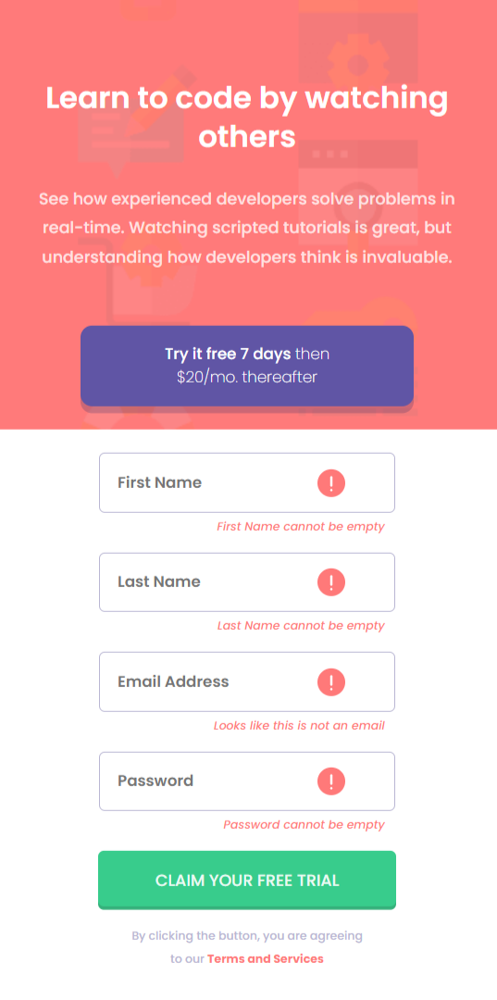

# Frontend Mentor - Intro Component with Sign Up Form

## Welcome! 👋
Thanks for checking out this front-end coding challenge.

### Features of this project:
- Users can view the optimal layout for the site depending on their device's screen size.
- Hover states are provided for all interactive elements on the page.
- The form includes error messages upon submission if:
  - Any `input` field is empty, displaying the message *"[Field Name] cannot be empty"*.
  - The email address is not formatted correctly (i.e., a correct email address should have this structure: `name@host.tld`), showing the message *"Looks like this is not an email"*.

## Screenshots:

### Desktop View:

### Desktop View with Error Message:

### Mobile View:

### Mobile View with Error Message:

Feel free to explore the project and suggest any improvements or changes!